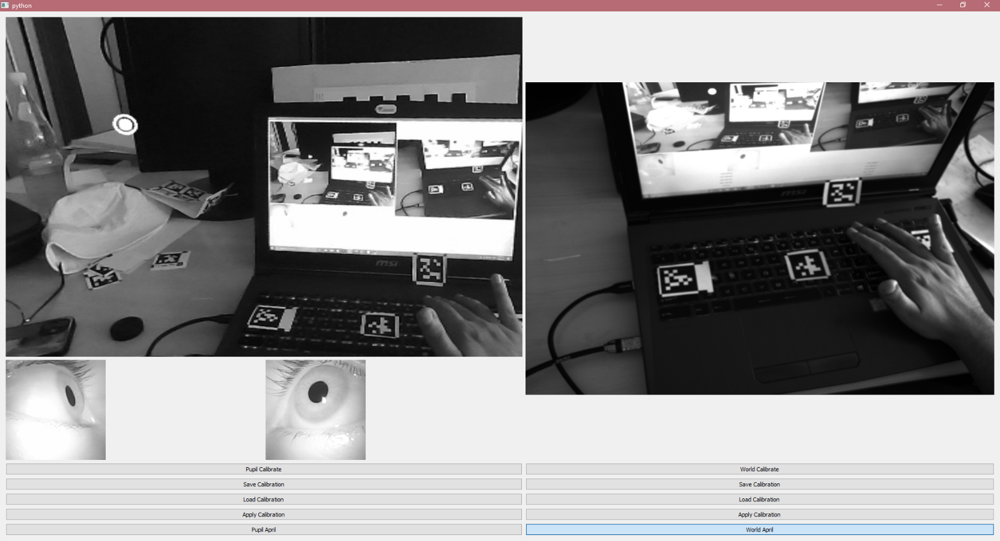

# PupilCalib

It's a software that provide an end to end solution for managing and updating and converting two coordinate spaces to each other. This mainly uses Pupil Eye Tracker in order to track Gaze Data in another frame of reference.

